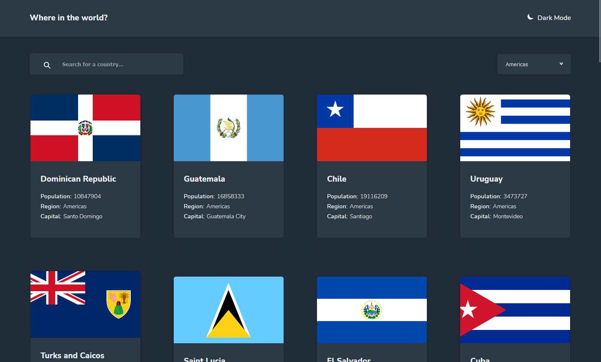
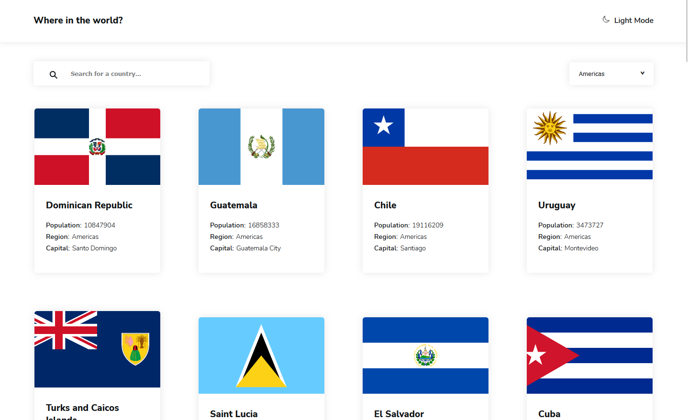
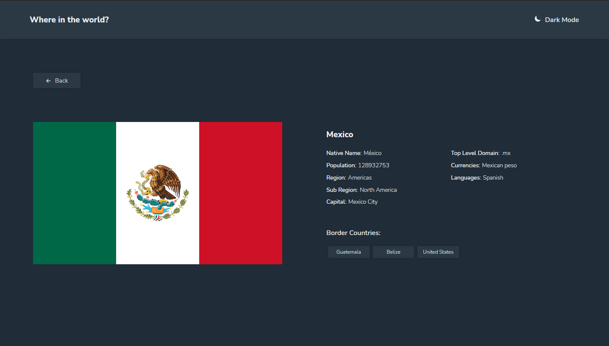
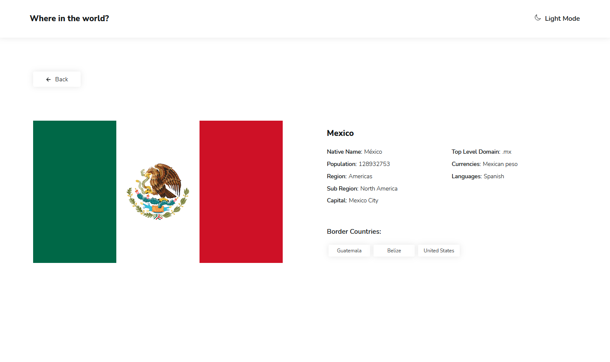
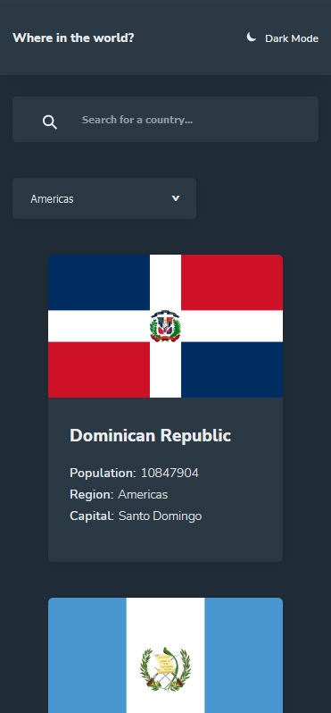
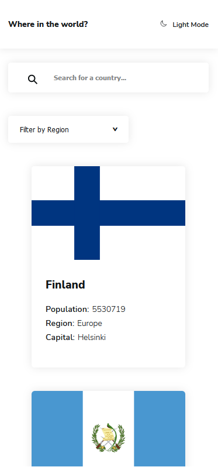
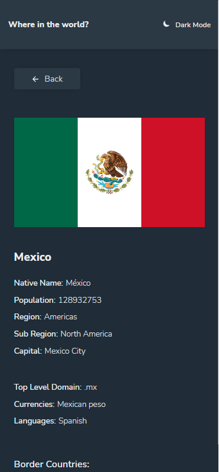
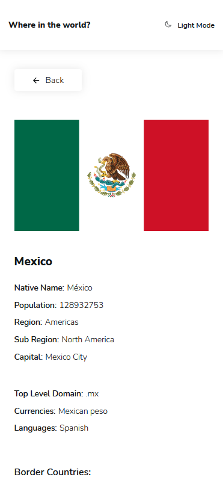

#  REST Countries API with color theme switcher and lazy load

This is a solution to the [REST Countries API with color theme switcher challenge on Frontend Mentor](https://www.frontendmentor.io/challenges/rest-countries-api-with-color-theme-switcher-5cacc469fec04111f7b848ca).

## Table of contents

- [Overview](#overview)
  - [The challenge](#the-challenge)
  - [Screenshot](#screenshot)
  - [Links](#links)
- [My process](#my-process)
  - [Built with](#built-with)
  - [What I practiced](#what-i-practiced)
- [Author](#author)


## Overview

### The challenge

Users should be able to:

- See all countries from the API on the homepage
- Search for a country using an `input` field
- Filter countries by region
- Click on a country to see more detailed information on a separate page
- Click through to the border countries on the detail page
- Toggle the color scheme between light and dark mode

### Screenshot










### Links

- Live Site URL: [https://countries-finder-ivanrice.vercel.app](https://countries-finder-ivanrice.vercel.app)

## My process

### Built with

- [React](https://reactjs.org/) - JS library
- Redux, Redux thunk
- React router
- Lazy load with Intersection Observer.
- [Styled Components](https://styled-components.com/) - For styles
- Mobile-first workflow
- Semantic HTML5 markup
- Flexbox for components.


### What I practiced


- Made use of localStorage with redux in order to preload and store a theme
```js
const getTheme = getLSThemeMode()
const INITIAL_STATE = {
  app: {
    themeMode: getTheme || 'darkMode',
    ...
  },
}
```
- Made use of custom hooks in order to handle the data
```js
  const [loading, error, countries, getCountries] = useCountriesState()
```
- Redux: changed "switch" for a literal object in order to handle "reducers"
```js
export const app = (state = INITIAL_STATE, action) => {
  return (
    {
      '@app/themeMode': { ...state, themeMode: action.payload },
      ...
    }[action.type] || state
  )
}
```

## Author

- Website - [ivanrice_](https://www.instagram.com/ivanrice_)
- Frontend Mentor - [@Ivanricee](https://www.frontendmentor.io/profile/Ivanricee)
- Twitter - [@ivanrice_](https://twitter.com/ivanrice_)